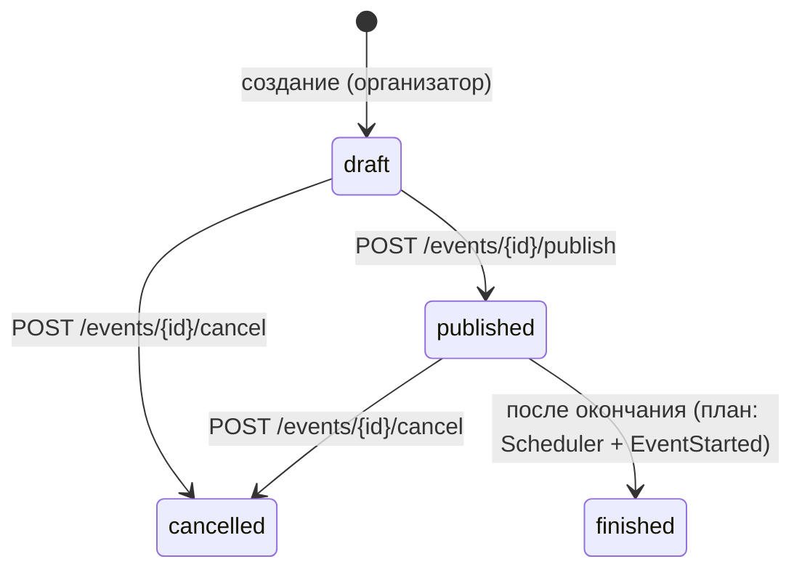
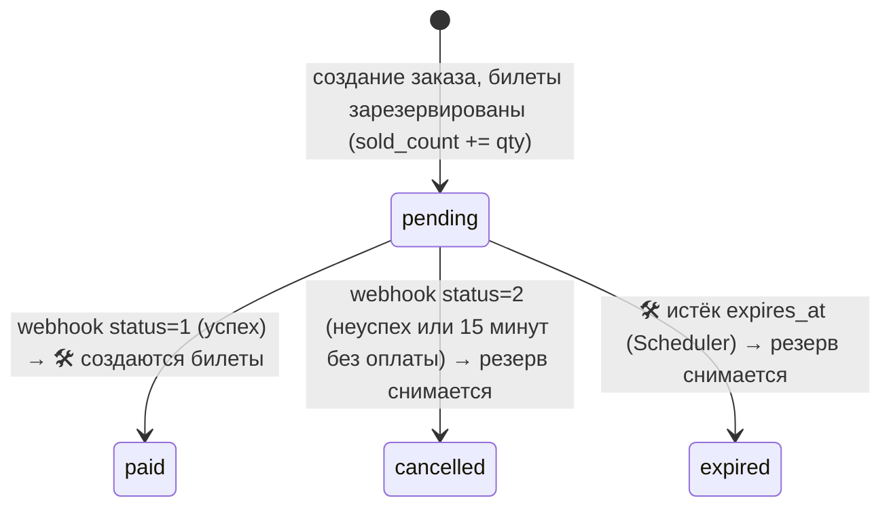

# Архитектура проекта

> Этот файл объясняет, **как устроен код и почему именно так**. Он нужен, чтобы
> я мог защитить проект: на каждое решение здесь есть «зачем».
> Что уже сделано, а что нет, — в `docs/05-PROGRESS.md`.

---

## 1. Общая картина

```
 Frontend (отдельная команда)            Training Payment System (проект преподавателя)
          │  JSON / REST                           ▲                         │
          ▼                                        │ 1) создать платёж       │ 2) webhook о результате
 ┌───────────────────────────────────────────────────────────────────────────▼──────────┐
 │ nginx → PHP-FPM (Laravel 13, PHP 8.5)                                                 │
 │   routes/api.php → Controller → FormRequest (валидация) → Policy (права) → Service   │
 │                                                     ↓                                │
 │                                         Eloquent Model ↔ PostgreSQL 17               │
 │   Очереди (jobs, database-драйвер) · Scheduler · Redis · Mailhog (письма локально)   │
 └──────────────────────────────────────────────────────────────────────────────────────┘
```

- **Только backend.** Всё общение идёт через JSON API (`/api/...`). Frontend не входит в ТЗ.
- **Монолит Laravel** с понятным разделением на слои (см. п. 3).
- **Платёжная система внешняя.** Это отдельное приложение преподавателя. Мы обращаемся к нему по HTTP, а оно сообщает результат вебхуком (`docs/04-PAYMENT.md`).

## 2. Стек

| Что | Технология | Почему |
|---|---|---|
| Язык / фреймворк | PHP 8.5, Laravel 13 | требование курса |
| Аутентификация | Laravel Sanctum (токены + cookie-сессии SPA) | своя реализация, starter kits запрещены ТЗ |
| БД | PostgreSQL 17 | надёжные транзакции и блокировки строк (`SELECT ... FOR UPDATE`) |
| Кэш / Redis | Redis 8 | есть в docker, пригодится для очередей и кэша |
| Очереди | Laravel Queues, драйвер `database` (`QUEUE_CONNECTION`) | требование ТЗ §16 |
| Почта локально | Mailhog (`http://localhost:8025`) | смотреть письма без реальной отправки |
| Тесты | PHPUnit 12, Feature-тесты | TDD, проверка прав и бизнес-правил |
| Окружение | Docker Compose: nginx, php, db, redis, mailhog | одинаковое окружение у всех |
| Стиль кода | Laravel Pint | единый стиль |

## 3. Слои и путь запроса

Пример: участник покупает билеты, `POST /api/events/5/orders`.

```
1. routes/api.php                  Route::post("/events/{event}/orders", OrderCreationController::class)
2. Middleware auth:sanctum         кто пользователь? (токен Bearer или cookie-сессия). Нет → 401
3. Route Model Binding             {event} → модель Event (нет такой → 404)
4. Middleware can:create,Order     OrderPolicy::create — только участник (иначе → 403)
5. CreateOrderRequest              валидация входных данных (ошибка → 422 с полями)
6. ->toDTO()                       CreateOrderData с массивом OrderItemData
7. OrderCreationService::create()  бизнес-логика в транзакции с блокировкой строк
8. Ответ                           {"success": true, "data": заказ}, код 201
```

Права (шаг 4) проверяются **до** валидации (шаг 5). Пользователь без прав сразу получает 403 и не узнаёт правил валидации.

| Слой | Папка | Ответственность | Правило |
|---|---|---|---|
| Маршруты | `routes/api.php` | URL → контроллер, middleware, **права** (`->middleware('can:update,event')`) | публичные GET сверху, защищённые в группе `auth:sanctum`, один маршрут — один контроллер |
| Контроллеры | `app/Http/Controllers/<Сущность>/` | «клей»: принять FormRequest, вызвать сервис, вернуть ответ | **однометодные** (`__invoke`), без бизнес-логики: `EventCreationController`, `EventPublicationController`... |
| Form Request | `app/Http/Requests/<Сущность>/` | валидация входа (ТЗ §20) и сборка DTO через `toDTO()` | `authorize()` возвращает `true`, права проверяет Policy в маршруте. DTO собирается только из `validated()` |
| Policies | `app/Policies` | кто что может (ТЗ §21) | одна Policy на модель, вызывается middleware `can:` (или `Gate::forUser()` на публичном маршруте) |
| Services | `app/Services` | бизнес-логика, транзакции, интеграции | один сервис на сущность (`EventService`), тяжёлые операции отдельно (`OrderCreationService`, `EventSearchService`) |
| DTO | `app/Data/<Сущности>/` | `readonly`-классы для передачи данных в сервис | `CategoryData`, `EventData`, `EventFilterData`, `CreateOrderData`, `OrderItemData`, `TicketTypeData`, `VenueData`, `PaymentData`, `PaymentWebhookData` |
| Contracts | `app/Contracts` | интерфейсы (сейчас `SignatureContract`) | привязка в `AppServiceProvider`, легко подменить в тестах |
| Exceptions | `app/Exceptions` | свои исключения для ошибок интеграции | сервис бросает, контроллер ловит и отдаёт нужный код (`InvalidSignatureException` → 403, `PaymentSystemException` → 502) |
| Enums | `app/Enums` | статусы и роли (`string`-backed) | каст в модели через `casts()` |
| Models | `app/Models` | таблицы, связи, касты | `#[Fillable([...])]`; служебные поля (`status`, `organizer_id`, `sold_count`) **не** fillable, задаются явно |
| Events / Listeners / Jobs | `app/Events`, `app/Listeners`, `app/Jobs` | реакции на события, фоновые задачи (ТЗ §16–17) | долгие операции (почта, HTTP) ставим в очередь |

**Почему так:**
- **Контроллер не знает бизнес-правил.** Их можно протестировать и переиспользовать, например вызвать из команды.
- **Однометодный контроллер = одно действие.** Имя класса говорит, что он делает. Файлы маленькие, нет «толстых» контроллеров на 7 методов (так же сделано у преподавателя: `PaymentCreationController`).
- **DTO вместо массива.** Сервис получает объект с типизированными полями (`EventData->starts_at`), а не `$request->all()`. Опечатка в имени поля ловится сразу, а сервис не зависит от HTTP.
- **Права в маршруте.** Глядя на `routes/api.php`, видно сразу и URL, и кто имеет к нему доступ.
- **Валидация, права и логика разделены.** Каждую часть легко найти и объяснить.
- **Интерфейсы (Contracts) для внешних систем.** В тестах подменяем реализацию и не ходим в настоящую платёжку.

## 4. Структура папок (важное)

```
ticket-project/
├── CLAUDE.md                ← инструкции для Claude (подхватываются автоматически)
├── docs/                    ← документация проекта (ТЗ, архитектура, API, оплата, прогресс, защита)
├── docker/                  ← docker-compose.yml, nginx, php (Dockerfile), postgres
│   └── .env.example         ← порты и пароли контейнеров
└── application/             ← Laravel-приложение
    ├── app/
    │   ├── Contracts/       ← SignatureContract (интерфейс подписи HMAC)
    │   ├── Data/            ← DTO: Auth/, Categories/, Events/, Orders/, Payments/, TicketTypes/, Venues/
    │   ├── Enums/           ← UserRole, EventStatus, OrderStatus
    │   ├── Exceptions/      ← InvalidSignatureException (→ 403), PaymentSystemException (→ 502)
    │   ├── Http/Controllers ← папки Admin/, Category/, Event/, Order/, Payment/, Profile/, TicketType/, Venue/
    │   │                      (однометодные контроллеры), плюс AuthController и HealthController
    │   ├── Http/Requests    ← папки Admin/, Auth/, Category/, Event/, Order/, Payment/, Profile/, TicketType/, Venue/
    │   ├── Listeners/       ← SendVerificationEmail
    │   ├── Mail/            ← EmailVerification
    │   ├── Models/          ← User, Category, Venue, Event, TicketType, Order, OrderItem
    │   ├── Policies/        ← User, Category, Venue, Event, TicketType, Order
    │   ├── Providers/       ← AppServiceProvider (rate limiters, привязки интерфейсов)
    │   └── Services/        ← AuthService, ProfileService, UserAdminService, CategoryService, VenueService,
    │                          EventService, EventSearchService, TicketTypeService, OrderCreationService, OrderListService,
    │                          PaymentCreationService, PaymentWebhookService, SignatureService
    ├── bootstrap/app.php    ← маршруты, middleware, рендер ошибок в JSON для /api/* (Scheduler пока нет)
    ├── database/
    │   ├── factories/       ← фабрики для тестов
    │   └── migrations/
    ├── routes/api.php       ← все API-маршруты
    └── tests/Feature/       ← Feature-тесты по фичам
```

> Фронтенд платёжки преподавателя (`resources/js`, `package.json`, `vite.config.js`) удалён в PR #13.
> В `resources/views` остался только шаблон письма `email/verification.blade.php`.

## 5. Роли и права (ТЗ §2, §21)

Роль хранится в `users.role` (enum `UserRole`: `admin`, `organiser`, `participant`). По умолчанию при регистрации ставится `participant`.
Проверки лежат в Policies и подключаются в `routes/api.php` через middleware `can:`. В модели `User` есть хелперы `isAdmin()`, `isOrganiser()`, `isParticipant()`.

| Действие | Гость | Участник | Организатор | Админ | Где проверяется |
|---|:-:|:-:|:-:|:-:|---|
| Смотреть опубликованные мероприятия | ✅ | ✅ | ✅ (+ свои черновики) | ✅ (все) | список: `EventSearchService`; одно: `EventPolicy::view` (иначе 404) |
| Создать мероприятие | ❌ | ❌ | ✅ | ❌ | `EventPolicy::create` |
| Редактировать, публиковать, отменять | ❌ | ❌ | только свои | ✅ | `EventPolicy::update/publish/cancel` |
| Удалить мероприятие | ❌ | ❌ | ❌ | ✅ | `EventPolicy::delete` |
| CRUD категорий и мест | ❌ | ❌ | ❌ | ✅ | `CategoryPolicy`, `VenuePolicy` |
| Создать тип билета | ❌ | ❌ | для своего мероприятия | ❌ | `TicketTypePolicy::create` |
| Изменить или удалить тип билета | ❌ | ❌ | своего мероприятия | ✅ | `TicketTypePolicy::update/delete` |
| Купить билеты (создать заказ) | ❌ (401) | ✅ | ❌ (403) | ❌ (403) | `OrderPolicy::create` |
| Получить ссылку на оплату | ❌ (401) | только свой заказ | ❌ (403) | ❌ (403) | `OrderPolicy::pay` |
| Смотреть заказы | ❌ | свои | заказы своих мероприятий | все | список: `OrderListService`; один: `OrderPolicy::view` |
| Список пользователей | ❌ | ❌ | ❌ | ✅ | `UserPolicy::viewAny` |
| Менять роль, блокировать | ❌ | ❌ | ❌ | ✅ (кроме себя) | `UserPolicy::manage` |

Заблокированный пользователь (`is_blocked = true`) не может войти. Проверка в `AuthService::login`.

## 6. База данных

### Текущая схема

```mermaid
erDiagram
    users ||--o{ events : "organizer_id"
    categories ||--o{ events : ""
    venues ||--o{ events : ""
    events ||--o{ ticket_types : "cascade"
    users ||--o{ orders : ""
    events ||--o{ orders : ""
    orders ||--o{ order_items : "cascade"
    ticket_types ||--o{ order_items : ""

    users { bigint id; string email; string password; string name; string role; bool is_blocked; timestamp email_verified_at }
    categories { bigint id; string name "unique"; text description }
    venues { bigint id; string name; string address; text description; int capacity }
    events { bigint id; string title; text description; datetime starts_at; datetime ends_at; bigint organizer_id; bigint category_id; bigint venue_id; string status }
    ticket_types { bigint id; bigint event_id; string name; text description; decimal price; int quantity; int sold_count }
    orders { bigint id; bigint user_id; bigint event_id; decimal total_amount; string status; string payment_reference "unique"; string payment_url }
    order_items { bigint id; bigint order_id; bigint ticket_type_id; int quantity; decimal price }
```

Ключевые решения:
- **`ticket_types.sold_count`.** Остаток не хранится отдельно, он считается: `available = quantity - sold_count` (`TicketType::availableCount()`). Так «количество доступных уменьшается автоматически» (ТЗ §7).
- **`order_items.price`.** Цена копируется в момент покупки. Если организатор потом поменяет цену, старые заказы не изменятся.
- **Деньги хранятся в `decimal(10,2)`, а не во `float`.** Float даёт ошибки округления (0.1 + 0.2 ≠ 0.3). Внимание: платёжная система принимает сумму **целым числом в тийинах** (×100), см. `04-PAYMENT.md`.
- **`cascadeOnDelete`.** Удаляем мероприятие, и вместе с ним удаляются его типы билетов. Удаляем заказ, удаляются его позиции.
- **`orders.payment_reference`** — UUID, под которым заказ известен платёжной системе (её `order_id`). Уникален, по нему вебхук находит заказ. **`orders.payment_url`** — ссылка на оплату, чтобы повторный `/pay` не создавал второй платёж.

### Что нужно добавить (план)

| Таблица или поле | Зачем | ТЗ |
|---|---|---|
| `orders.expires_at` | когда снять резерв с неоплаченного заказа | §9 (`expired`) |
| `orders.refund_required` (bool) | отметка «нужен возврат» при отмене мероприятия | §18 |
| `tickets` (`number` unique `EVT-XXXXXX`, `user_id`, `event_id`, `ticket_type_id`, `order_id`, `status`, `used_at`) | билет после оплаты, по одному на каждую купленную штуку | §11, §13 |
| `ticket_registrations` (`ticket_id` **unique**, `registered_at`) | регистрация участника. `unique` защищает от повторной регистрации | §12 |

## 7. Жизненные циклы (статусы)

### Мероприятие (`EventStatus`)



- Опубликовать можно только `draft`, иначе 422.
- Отменить можно только `draft` или `published`.
- Купить билеты можно только при `published` (`OrderCreationService`).
- Логика переходов — в `EventService::publish()` и `::cancel()`. Ошибка: `ValidationException`, 422 с `errors.status`.

### Заказ (`OrderStatus`)



Сейчас работают `pending → paid` и `pending → cancelled` (`PaymentWebhookService`). Перехода в `expired` и создания билетов пока нет.

## 8. Важные механизмы (что уже работает)

### Резервирование билетов без «перепродажи» (`OrderCreationService::create`)
1. Сначала проверяется, что мероприятие `published`.
2. Дальше всё идёт **в одной транзакции** `DB::transaction(...)`.
3. Типы билетов читаются с **`lockForUpdate()`** (`SELECT ... FOR UPDATE`). Второй покупатель тех же билетов ждёт, пока первый закончит. Так два человека не купят последний билет одновременно (race condition).
4. Для каждой позиции проверяется, что тип принадлежит этому мероприятию и билетов хватает. Иначе выбрасывается `ValidationException` (422), и транзакция откатывается целиком.
5. Создаётся заказ `pending` и позиции, `sold_count` увеличивается. Это и есть резерв (ТЗ §8 п.4).

### Аутентификация (Sanctum, два режима)
- **Токен.** `POST /api/auth/login` возвращает `{"token": "...", "auth": "token"}`. Клиент шлёт `Authorization: Bearer <token>`. Так работают Postman и мобильные клиенты.
- **Cookie (SPA).** Если запрос пришёл с домена из `SANCTUM_STATEFUL_DOMAINS`, создаётся сессия и возвращается `{"auth": "cookie"}`. Для SPA так безопаснее: токен не лежит в JS.
- **Logout** удаляет текущий токен и завершает сессию.
- **Rate limiting** (`AppServiceProvider`): регистрация не чаще 10 раз за 30 минут с одного IP. Логин: 3 неудачные попытки (422) за 30 минут на email.
- **Подтверждение email.** При регистрации срабатывает событие `Registered`. Listener `SendVerificationEmail` отправляет код, код хранится в кэше 1 час. Подтверждение: `POST /api/auth/verify`.

### Видимость мероприятия (`EventPolicy::view`, `EventShowController`)
- `GET /events/{event}` публичный, поэтому пользователь может быть гостем. Проверка: `Gate::forUser($request->user('sanctum'))->denies('view', $event)`.
- Опубликованное видят все. Черновик и отменённое видят только его организатор и админ.
- Для остальных ответ **404, а не 403**: так посторонний не узнает, что такое мероприятие вообще существует.

### Поиск и фильтрация (`EventListController` → `EventSearchService`, ТЗ §14)
- Параметры валидирует `EventListRequest` и собирает в DTO `EventFilterData`.
- Видимость зависит от роли. Гость и участник видят только `published`. Организатор видит `published` и свои. Админ видит всё.
- Фильтры: `search` (по `title`), `category_id`, `venue_id`, `date_from`, `date_to`.
- Сортировка `sort=date|-date|price|-price`. Для сортировки по цене подзапросом считается `min_price`, минимальная цена типа билета.
- Пагинация `per_page` (1–100, по умолчанию 15).

### Ошибки в JSON
В `bootstrap/app.php` настроено: для `api/*` любые ошибки отдаются JSON-ом. Используемые коды: 401, 403, 404, 422, 502 (платёжка недоступна).

## 9. Оплата (сделано в PR #14, подробно в `04-PAYMENT.md`)

```
POST /api/events/{event}/orders               (OrderCreationController)
  → OrderCreationService: резерв + заказ pending (транзакция)
  ← 201 {"success": true, "data": заказ}

POST /api/orders/{order}/pay                  (PaymentCreationController, can:pay,order)
  → PaymentCreationService: только pending; если ссылка уже есть — вернуть её
  → подпись HMAC (SignatureService) → Http::post(PAYMENT_URL/api/create-payment), вне транзакций
  → сохранить payment_reference (UUID) и payment_url в заказ
  ← 200 {"success": true, "data": {"payment_url": ...}}  |  502 если платёжка недоступна

Платёжка → POST /api/payments/webhook (X-Signature)   (PaymentWebhookController, без auth)
  → PaymentWebhookService: подпись (hash_equals) → заказ по payment_reference (lockForUpdate)
  → не pending: ничего не делаем (идемпотентность)
  → status=1: paid   (🛠 дальше: событие OrderPaid → GenerateTickets + SendPurchaseConfirmation в очереди)
  → status=2: cancelled + снять резерв
```

## 10. Образец: проект преподавателя

Наш репозиторий — **форк** учебной платёжной системы преподавателя (Mikhail Kramer, GitHub `mike-kramer`, «Training Payment System»):
**https://github.com/mike-kramer/training-ps**

Код платёжки удалён у нас коммитом `63e298b`, но **весь сохранён в истории git** на момент форка (`0224724`, 2026-09-06). Посмотреть можно так:

```bash
git show 0224724:application/app/Services/PaymentCreationService.php
git show 0224724 --stat            # последний коммит преподавателя, который мы влили
git ls-tree -r --name-only 0224724 application/app   # все его файлы
```

Преподаватель продолжает развивать репозиторий. Свежее смотреть через `upstream` (настройка в `CLAUDE.md`).
Только читаем, **в наш проект не мержим**.

Паттерны преподавателя, которые мы повторяем:
- **Интерфейс и реализация.** `app/Contracts/SignatureContract` и `app/Services/SignatureService`, привязка `singleton` в `AppServiceProvider`.
- **DTO.** `readonly class PaymentData` и `FormRequest::toDTO()`.
- **Однометодные контроллеры** через `__invoke` (`PaymentCreationController`). После PR #12 у нас так сделаны все контроллеры, кроме `AuthController`.
- **Права в маршруте** через `->middleware("can:update,cashbox")`. Мы делаем так же: `->middleware('can:update,event')`.
- **Job с повторами и экспоненциальной задержкой** (`SendMerchantWebhook`: до 5 попыток, `2^(n-1)` минут).
- **Консольная команда и Scheduler** (`#[Signature('app:cancel-old-payments')]` плюс `everyFiveMinutes()` в `bootstrap/app.php`).
- **Тесты внешних вызовов** через `Http::fake()` и `Http::assertSent(...)`, подмена интерфейсов через `$this->mock(Contract::class, ...)`.

Новое у преподавателя после нашего форка (`upstream/master`, сверено на `664301c`). Пригодится нам:

| Паттерн | Где у него | Где применить у нас |
|---|---|---|
| Список пользователей для админа: пагинация и фильтры, `->toResourceCollection()` | `Admin/UsersController::usersList`, `UserAdminService::getUserList` | `GET /admin/users` (недочёт №2 в `05-PROGRESS.md`) |
| **Фильтры как отдельные классы** (паттерн Strategy): интерфейс `UserFilterContract::alterBuilder()`, список в `UserFiltersApplier::FILTER_CLASSES` | `app/Services/Assistants/UserFilters/*` | можно так же переписать фильтры `GET /events` |
| **API Resources**: скрыть лишние поля из ответа | `app/Http/Resources/UserResource.php`, `UserCollection.php` | ответы заказов и билетов |
| **Идемпотентность по заголовку** `Idempotence-Key`: `Cache::lock` + кэш ответа на сутки, повтор → тот же ответ, параллельный → 409 | `app/Http/Middleware/IdempotenceMiddleware.php` | `POST /events/{event}/orders` (защита от двойного клика) |
| Транзакция `SERIALIZABLE` с повторами `DB::transaction(fn, 3)` | `WithdrawalService::createWithdrawalRequest` | альтернатива `lockForUpdate`, хорошо знать для защиты |
| Middleware блокировки забаненных на группу маршрутов | `BlockBannedUsersMiddleware` | у нас блокировка проверяется только при логине. Уже выданный токен продолжает работать |
| Статистика по периодам (Strategy + Factory) | `app/Services/Statistics/*` | «продажи своих мероприятий» организатора (ТЗ §2) |
| Деплой на сервер: nginx + certbot | ветка `feat/server-docker`, папка `server-docker/` | если проект нужно будет выложить |
